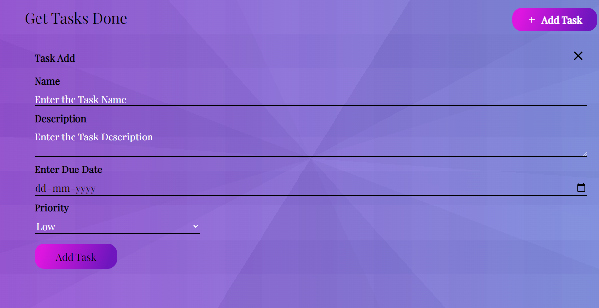
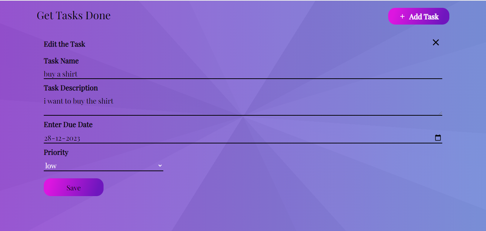

# Task Management App

A simple Task Management App built with React for managing tasks.
#  Live Link of Site :-https://adhikariPraveen.github.io/Task-Management-App;

## Table of Contents

- [Introduction](#introduction)
- [Features](#features)
- [Project Structure](#project-structure)
- [Components](#components)
  - [TaskList](#tasklist)
  - [AddTask](#addtask)
  - [EditTask](#edittask)
- [Setup](#setup)
- [Usage](#usage)
-

## Introduction

This Task Management App allows users to manage their tasks efficiently. It provides a user-friendly interface with features such as task listing, adding new tasks,editing existing tasks and deleting the Tasks.

## Features

- View a list of tasks
- Add new tasks
- Edit existing tasks
-Delete tasks

## Project Structure

Describe the high-level project structure here. You can use a tree structure to represent directories and files.

task-management-app/
|-- src/
| |-- components/
| |-- TaskList
| |   |--TaskList.js
| |   |--TaskList.css
| |--AddTask
| |   |--AddTask.js
| |   |--AddTask.css
| |-- EditTask
|      |--EditTask.js
|-- public/
|-- package.json
|-- README.md

## Components

### TaskList

The `TaskList` component displays a list of tasks. It allows users to mark tasks as completed, edit task details, and delete tasks.

.png)

### AddTask

The `AddTask` component provides a form for users to add new tasks. Users can enter task details such as name, description,due date and priority.


### EditTask

The `EditTask` component allows users to edit the details of an existing task. It displays the current task details and updates them upon user input.


## Setup

Provide instructions on how to set up the development environment.

```bash
# Clone the repository
git clone https://github.com/Adhikaripraveen/task-management-app.git

# Navigate to the project directory
cd task-management-app

# Install dependencies
npm install
# Run the application
npm start

